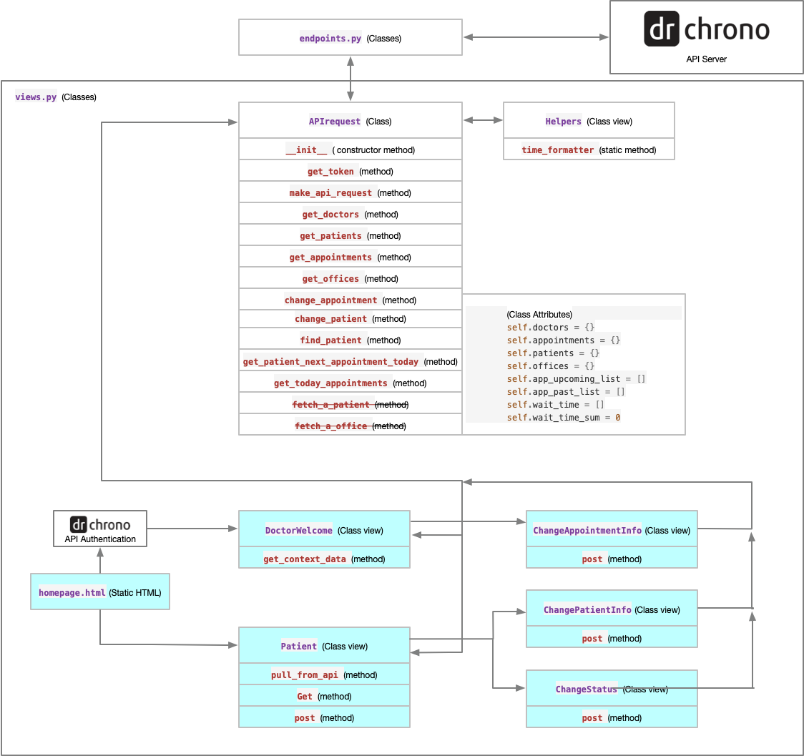

# EHR Entry Using RESTful API

This is the project for **DrChrono Hackathon**, which utilizes DrChrono's RESTful API to achieve basic EHR functions, including

1. Appointment check-in;
2. Patient information editing;
3. Appointment information editing;
4. Appointment statistic (patient wait time)

The web app is built with **Django** using **Python**, and no data was stored locally, but all by pulling and pushing from, to DrChrono's server using developer API.

#### Requirements and Environment Setup

Please refer to the bottom of this document for details, you may need to create a DrChrono developer account, and modify the token using yours to able to use the API.

#### Structure



The diagram above shows clearly how this app works, light blue background means it is a view (with HTML page). API's basic endpoints (`endpoints.py`) was provided to communicate with server including authentication and CRUD operations. `APIrequest` class was mainly used as an agent for the app's views to establish API requests, and then using `endpoints.py` to send to or request from the server.

Interfaces:

All pages uses [Bootstrap 4](https://getbootstrap.com) and icons from[Front Awesome](https://fontawesome.com), and main interfaces are:


#### Demo:

[](http://www.youtube.com/watch?v=aP2mzLitJDM "")


> ### Doctor Dashboard
>
> Imagine you’re a busy doctor running a lean medical practice. Your receptionist doesn’t have time to print out your daily schedule, 
> or bother you with constant updates as patients check in, schedule new appointments, or cancel. 
> You want to replace old office workflows with an interactive dashboard.
>
> After you log into to the system, the doctor should see an interactive page they can leave open that displays today’s appointments, 
> indicating which patients are scheduled, which patients have checked in, and how long they have been waiting. From this screen, the doctor 
> can indicate they are seeing a patient, which stops the “time spent waiting” clock. It should be able to update when an appointment status 
> changes or a new appointment is scheduled by the receptionist or patient. It should also display some summary statistics, 
> like the overall average wait time for all patients they have ever seen.
>
> Outside of these base requirements, we hope you are able to develop any features you think make sense. Put yourself in the shoes of the doctor. 
> What tools would be useful if you were planning your day? We love to see creativity and initiative!
>
>
> Outside of these base requirements, you are free to develop any features you think
> make sense.
>
> To begin, fork the drchrono API project repo at https://github.com/drchrono/api-example-django
>
> We’ve built this repo to save you some set-up time! It contains a few baseline structural elements for you to build on.
> It’s a great starting point, but there are probably some tweaks and improvements to be made before you continue building 
> out new functionality. It doesn't quite work; it's your job to make it work, and then make it awesome!
>
> Use the drchrono API docs and feel free to reach out to the people operations team with any questions and we'll get back
> to you ASAP.
>
>
> ### Check-in kiosk
>
> Before reading this please read the prompt for Doctor Dashboard, as we will be building on top of that.
>
> Here we add a sign-in kiosk, similar to the ones you see for flight check-ins.
> There should be an account association flow where a doctor can authenticate using
> their drchrono account and set up the kiosk for their office.
> After the doctor is logged in, a page should be displayed that lets patients check
> in. A patient with an appointment should first confirm their identity (first/last
> name maybe SSN) then be able to update their demographic information using the
> patient chart API endpoint.  Once the they have filled out that information the
> app can set the appointment status to "Arrived" (Appointment API Docs).
>
>
> ### Requirements
> - a free [drchrono.com](https://www.drchrono.com/sign-up/) account
> - [docker](https://www.docker.com/community-edition) (optional)
>
>
> #### API token 
> The first thing to do is get an API token from drchrono.com, and connect this local application to it!
>
> This project has `social-auth` preconfigured for you. The `social_auth_drchrono/` contains a custom provider for
> [Python Social Auth](http://python-social-auth.readthedocs.io/en/latest/) that handles OAUTH through drchrono. It should
>  require only minimal configuration and tweaking. 
>
> 1) Log in to [drchrono.com](https://www.drchrono.com)
> 2) Go to the [API management page](https://app.drchrono.com/api-management/)
> 3) Make a new application
> 4) Copy the `SOCIAL_AUTH_CLIENT_ID` and `SOCIAL_AUTH_CLIENT_SECRET` to your `docker/environment` file.
> 5) Set your redirect URI to `http://localhost:8080/complete/drchrono/`
>
>
> ### Dev environment Setup
> If you're familiar with it, docker should take care of all the dependencies for you. It will create one container with 
> all the python dependencies.The project uses SQLite3 as a database back-end, so you shouldn't need to mess with anything 
> to get django up and running. See `docker-compose.yml` for details.
>
> ``` 
> $ git clone git@github.com:drchrono/api-example-django.git hackathon
> $ docker-compose up
> ```
>
> If you don't want to use docker, that's fine too! The project is fairly small and self-contained. You can probably get all
> the dependencies installed and running on your favorite platform with `pip install -r requirements.txt && python manage.py runserver`. You'll have to configure the `CLIENT_ID` and `CLIENT_SECRET` variables by hand, though.
>
> Once the dev server is running, connect with a browser to [http://localhost:8080/setup]() and use the web to authorize 
> the application.
>
>
> ### Happy Hacking!
> If you have trouble at any point in the setup process, feel free to reach out to the developer
> who introduced you to the project. We try to minimize setup friction, but sometimes things go wrong, and we genuinely 
> appreciate feedback about how to make things better!